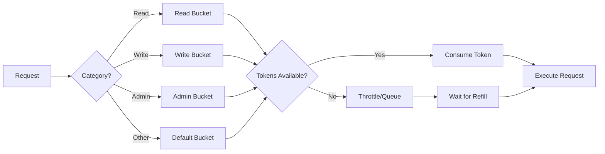

# Rate Limiting Guide

This guide explains the rate limiting system in Lark OpenAPI MCP Tool, helping you avoid API quota exhaustion and ensure stable operation.

## Table of Contents

1. [Overview](#overview)
2. [How It Works](#how-it-works)
3. [Configuration](#configuration)
4. [Request Categories](#request-categories)
5. [Monitoring and Metrics](#monitoring-and-metrics)
6. [Best Practices](#best-practices)
7. [Troubleshooting](#troubleshooting)

## Overview

The Lark OpenAPI MCP Tool implements a token bucket algorithm for rate limiting, protecting your application from exceeding Feishu/Lark API quotas. Rate limiting is enabled by default with conservative limits based on official API restrictions.

### Key Features

- **Automatic request categorization** (read, write, admin)
- **Per-category rate limits** with different capacities
- **Real-time metrics** and monitoring
- **Configurable limits** based on your app's quota
- **Graceful degradation** with queuing

## How It Works

### Token Bucket Algorithm

Each category has a "bucket" containing tokens:
1. **Capacity**: Maximum tokens the bucket can hold
2. **Refill Rate**: Tokens added per interval
3. **Consumption**: Each request consumes one token

```
Bucket: [🪙🪙🪙🪙🪙] (5/10 tokens)
         ↓ Request consumes 1 token
Bucket: [🪙🪙🪙🪙] (4/10 tokens)
         ↓ Time passes, tokens refill
Bucket: [🪙🪙🪙🪙🪙🪙] (6/10 tokens)
```

### Request Flow



## Configuration

### Basic Configuration

```typescript
const client = new LarkMcpTool({
  appId: 'your_app_id',
  appSecret: 'your_app_secret',
  rateLimiting: {
    enabled: true,  // Default: true
    rateLimits: {
      default: { capacity: 100, tokensPerInterval: 50, intervalMs: 60000 },
      read: { capacity: 200, tokensPerInterval: 100, intervalMs: 60000 },
      write: { capacity: 20, tokensPerInterval: 10, intervalMs: 60000 },
      admin: { capacity: 5, tokensPerInterval: 2, intervalMs: 60000 }
    }
  }
});
```

### CLI Configuration

```bash
# Disable rate limiting (not recommended)
lark-mcp mcp --disable-rate-limit

# Set custom limits
lark-mcp mcp --rate-limit-requests 100 --rate-limit-writes 20
```

### Environment Variables

```bash
# Set via environment
export LARK_RATE_LIMIT_ENABLED=true
export LARK_RATE_LIMIT_REQUESTS=100
export LARK_RATE_LIMIT_WRITES=20
```

### Configuration File

```json
{
  "appId": "your_app_id",
  "appSecret": "your_app_secret",
  "rateLimiting": {
    "enabled": true,
    "rateLimits": {
      "default": {
        "capacity": 100,
        "tokensPerInterval": 50,
        "intervalMs": 60000
      }
    }
  }
}
```

## Request Categories

Requests are automatically categorized based on URL patterns and HTTP methods:

### Read Operations (Higher Limits)

- **Capacity**: 200 tokens
- **Refill**: 100 tokens/minute

Examples:
- `GET /open-apis/im/v1/messages`
- `GET /open-apis/bitable/v1/apps/{app_token}/tables`
- `GET /open-apis/wiki/v2/spaces/get_node`
- Search operations
- List operations

### Write Operations (Lower Limits)

- **Capacity**: 20 tokens
- **Refill**: 10 tokens/minute

Examples:
- `POST /open-apis/im/v1/messages`
- `POST /open-apis/bitable/v1/apps/{app_token}/tables`
- `PUT /open-apis/docx/v1/documents/{document_id}`
- Create operations
- Update operations

### Admin Operations (Strictest Limits)

- **Capacity**: 5 tokens
- **Refill**: 2 tokens/minute

Examples:
- Permission changes
- App configuration updates
- Workspace management
- User management

### Default Operations

- **Capacity**: 100 tokens
- **Refill**: 50 tokens/minute

All other operations not matching above categories.

## Monitoring and Metrics

### Get Current Metrics

```typescript
const metrics = client.getRateLimitMetrics();
console.log(metrics);
```

Response:
```typescript
{
  requestCounts: {
    total: 1523,
    read: 1200,
    write: 300,
    admin: 23
  },
  throttledCounts: {
    total: 45,
    read: 5,
    write: 35,
    admin: 5
  },
  bucketStates: {
    default: { available: 45, capacity: 100 },
    read: { available: 150, capacity: 200 },
    write: { available: 5, capacity: 20 },
    admin: { available: 2, capacity: 5 }
  },
  averageWaitTime: 234, // milliseconds
  lastReset: '2024-01-15T10:00:00Z'
}
```

### Real-time Monitoring

```typescript
// Monitor rate limit events
client.on('rateLimitThrottled', (event) => {
  console.log(`Request throttled: ${event.category}, wait: ${event.waitTime}ms`);
});

client.on('rateLimitExhausted', (event) => {
  console.log(`Bucket exhausted: ${event.category}`);
});
```

### Logging

Enable debug logging for rate limit details:

```typescript
const client = new LarkMcpTool({
  appId: 'xxx',
  appSecret: 'xxx',
  logLevel: 'debug'
});
```

## Best Practices

### 1. Batch Operations

Instead of multiple individual requests:
```typescript
// ❌ Bad: Multiple individual creates
for (const record of records) {
  await client.call('bitable.v1.appTableRecord.create', {
    path: { app_token, table_id },
    data: { fields: record }
  });
}

// ✅ Good: Single batch create
await client.call('bitable.v1.appTableRecord.batchCreate', {
  path: { app_token, table_id },
  data: { records: records.map(fields => ({ fields })) }
});
```

### 2. Implement Retry Logic

```typescript
async function callWithRetry(client, toolName, params, maxRetries = 3) {
  for (let i = 0; i < maxRetries; i++) {
    try {
      return await client.call(toolName, params);
    } catch (error) {
      if (error.code === 99991429 && i < maxRetries - 1) {
        // Rate limited, wait exponentially
        const waitTime = Math.pow(2, i) * 1000;
        await new Promise(resolve => setTimeout(resolve, waitTime));
        continue;
      }
      throw error;
    }
  }
}
```

### 3. Prioritize Requests

```typescript
// High priority requests
await client.call('im.v1.message.create', urgentMessage, {
  priority: 'high'
});

// Low priority background tasks
await client.call('bitable.v1.app.get', { path: { app_token } }, {
  priority: 'low'
});
```

### 4. Cache Responses

```typescript
const cache = new Map();

async function getCachedData(client, key, fetcher) {
  if (cache.has(key)) {
    const { data, timestamp } = cache.get(key);
    if (Date.now() - timestamp < 300000) { // 5 minutes
      return data;
    }
  }
  
  const data = await fetcher();
  cache.set(key, { data, timestamp: Date.now() });
  return data;
}

// Usage
const tables = await getCachedData(
  client,
  `tables-${app_token}`,
  () => client.call('bitable.v1.appTable.list', { path: { app_token } })
);
```

### 5. Monitor and Adjust

```typescript
// Periodic monitoring
setInterval(async () => {
  const metrics = client.getRateLimitMetrics();
  
  // Alert if throttling is high
  if (metrics.throttledCounts.total > 100) {
    console.warn('High throttling detected:', metrics);
    
    // Dynamically adjust limits
    client.setRateLimitConfig({
      write: { capacity: 30, tokensPerInterval: 15, intervalMs: 60000 }
    });
  }
}, 60000);
```

## Troubleshooting

### Common Issues

#### 1. Frequent Throttling

**Symptoms**: Many "Request throttled" messages
**Solution**:
```typescript
// Increase limits based on your quota
rateLimiting: {
  rateLimits: {
    read: { capacity: 300, tokensPerInterval: 150, intervalMs: 60000 }
  }
}
```

#### 2. Burst Traffic Handling

**Symptoms**: Throttling during peak times
**Solution**:
```typescript
// Increase bucket capacity for bursts
rateLimiting: {
  rateLimits: {
    default: { capacity: 200, tokensPerInterval: 50, intervalMs: 60000 }
    //        ↑ Higher capacity allows bursts
  }
}
```

#### 3. Different API Quotas

**Symptoms**: Some APIs have different limits
**Solution**:
```typescript
// Custom category for specific APIs
client.addRateLimitCategory('special', {
  capacity: 10,
  tokensPerInterval: 5,
  intervalMs: 60000,
  urlPatterns: [/\/open-apis\/special\//]
});
```

### Debug Mode

Enable detailed logging:

```typescript
// Via configuration
const client = new LarkMcpTool({
  appId: 'xxx',
  appSecret: 'xxx',
  debug: true,
  rateLimiting: {
    debug: true
  }
});

// Via environment
export LARK_DEBUG=true
export LARK_RATE_LIMIT_DEBUG=true
```

### Rate Limit Headers

Check API response headers:
```
X-RateLimit-Limit: 100
X-RateLimit-Remaining: 45
X-RateLimit-Reset: 1642320000
```

## Advanced Configuration

### Custom Rate Limiter

Implement your own rate limiting strategy:

```typescript
class CustomRateLimiter {
  async checkLimit(request) {
    // Your custom logic
    return { allowed: true, waitTime: 0 };
  }
}

const client = new LarkMcpTool({
  appId: 'xxx',
  appSecret: 'xxx',
  rateLimiter: new CustomRateLimiter()
});
```

### Per-User Rate Limiting

```typescript
const userLimiters = new Map();

function getUserLimiter(userId) {
  if (!userLimiters.has(userId)) {
    userLimiters.set(userId, new RateLimiter({
      capacity: 50,
      tokensPerInterval: 25,
      intervalMs: 60000
    }));
  }
  return userLimiters.get(userId);
}

// Use per-user limiter
const limiter = getUserLimiter(userId);
if (await limiter.checkLimit()) {
  await client.call(toolName, params);
}
```

### Dynamic Adjustment

```typescript
// Adjust based on time of day
function getDynamicLimits() {
  const hour = new Date().getHours();
  
  // Lower limits during peak hours (9-17)
  if (hour >= 9 && hour <= 17) {
    return {
      read: { capacity: 150, tokensPerInterval: 75, intervalMs: 60000 },
      write: { capacity: 15, tokensPerInterval: 7, intervalMs: 60000 }
    };
  }
  
  // Higher limits during off-peak
  return {
    read: { capacity: 300, tokensPerInterval: 150, intervalMs: 60000 },
    write: { capacity: 30, tokensPerInterval: 15, intervalMs: 60000 }
  };
}

// Apply dynamic limits
client.setRateLimitConfig(getDynamicLimits());
```

## Integration with Monitoring

### Prometheus Metrics

```typescript
// Export metrics for Prometheus
app.get('/metrics', (req, res) => {
  const metrics = client.getRateLimitMetrics();
  
  res.set('Content-Type', 'text/plain');
  res.send(`
# HELP lark_mcp_requests_total Total requests
# TYPE lark_mcp_requests_total counter
lark_mcp_requests_total{category="read"} ${metrics.requestCounts.read}
lark_mcp_requests_total{category="write"} ${metrics.requestCounts.write}

# HELP lark_mcp_throttled_total Total throttled requests
# TYPE lark_mcp_throttled_total counter
lark_mcp_throttled_total{category="read"} ${metrics.throttledCounts.read}
lark_mcp_throttled_total{category="write"} ${metrics.throttledCounts.write}

# HELP lark_mcp_bucket_available Available tokens
# TYPE lark_mcp_bucket_available gauge
lark_mcp_bucket_available{category="read"} ${metrics.bucketStates.read.available}
lark_mcp_bucket_available{category="write"} ${metrics.bucketStates.write.available}
  `);
});
```

## Summary

Rate limiting is crucial for stable Lark API integration. Key takeaways:

1. **Keep it enabled**: Rate limiting protects against quota exhaustion
2. **Monitor metrics**: Track throttling and adjust limits accordingly
3. **Use batching**: Reduce request count with batch operations
4. **Implement retries**: Handle rate limit errors gracefully
5. **Cache when possible**: Reduce unnecessary API calls

For specific quota information for your app, check the [Feishu Open Platform](https://open.feishu.cn/) or [Lark Developer Portal](https://open.larksuite.com/).