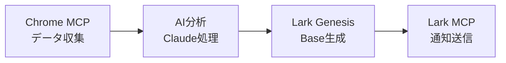
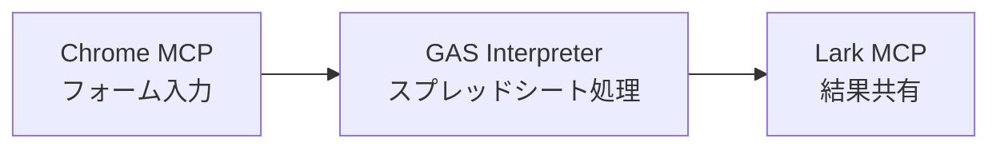

# Chrome MCP 実践的活用事例

## 🎯 ビジネス活用パターン

### 1. 📊 競合分析自動化

**シナリオ**: 競合他社の価格調査を自動化

```text
Claude への指示:
「以下の競合サイト5社を訪問して、指定商品の価格情報を収集し、
比較表をLark Baseに作成してください」

実行フロー:
1. Chrome MCP → 各競合サイトを自動巡回
2. Chrome MCP → 価格情報を抽出
3. Lark Genesis → 価格比較用のBaseを自動生成
4. Lark MCP → データを構造化して投入
```

### 2. 🔍 リード獲得自動化

**シナリオ**: LinkedIn での潜在顧客発見

```text
Claude への指示:
「LinkedInで『AI導入』に関心のある企業担当者を検索し、
プロフィール情報をCRM用のLark Baseに整理してください」

実行フロー:
1. Chrome MCP → LinkedIn検索実行
2. Chrome MCP → プロフィール情報収集
3. Lark Genesis → CRM Baseの自動生成
4. Lark MCP → リード情報を投入
5. Chrome MCP → 関連記事の情報も追加収集
```

### 3. 📈 ソーシャルメディア監視

**シナリオ**: ブランド言及監視とレポート生成

```text
Claude への指示:
「Twitter、Facebook、Redditで弊社ブランドの言及を監視し、
センチメント分析結果を週次レポートとしてまとめてください」

実行フロー:
1. Chrome MCP → 各SNSで検索実行
2. Chrome MCP → 言及投稿のスクリーンショット収集
3. AI分析 → センチメント判定
4. Lark Genesis → レポート用Baseの生成
5. GAS Interpreter → Googleスプレッドシートでグラフ作成
```

## 🏢 業界別活用例

### 🛒 EC・小売業

#### 在庫監視システム
```text
「AmazonとYahooショッピングで競合商品の在庫状況を確認し、
在庫切れの商品があれば仕入れ担当者にLarkメッセージで通知してください」
```

#### 顧客レビュー分析
```text
「楽天市場の弊社商品レビューを全て収集し、
ネガティブレビューの傾向分析をしてLark Baseにまとめてください」
```

### 🏭 製造業

#### 部品価格調査
```text
「主要な部品サプライヤー10社のWebサイトから、
指定部品の最新価格を収集し、調達コスト分析表を作成してください」
```

#### 技術トレンド調査
```text
「IEEE、技術ブログ、特許サイトから最新の製造技術トレンドを調査し、
R&D部門向けの技術レポートを作成してください」
```

### 🏦 金融・投資

#### 市場調査自動化
```text
「主要証券会社のレポートページから今週の市場分析レポートを収集し、
要点をまとめて投資判断用のダッシュボードを作成してください」
```

#### 規制情報監視
```text
「金融庁、日銀、各業界団体のWebサイトから規制変更情報を監視し、
重要な変更があれば法務部にアラートを送信してください」
```

### 🎓 教育・研修

#### 学習コンテンツ収集
```text
「Coursera、edX、Udemyから機械学習関連の最新コースを検索し、
社員研修プログラム用の推奨コース一覧を作成してください」
```

#### 学術論文調査
```text
「Google Scholar、arXivから指定キーワードの最新論文を収集し、
研究動向分析レポートを作成してください」
```

## 🔄 ワークフロー自動化パターン

### パターン1: データ収集 → 分析 → 通知



### パターン2: 監視 → 判定 → アクション


### パターン3: 入力 → 処理 → 出力



## 💡 高度な連携活用

### 1. AIエージェント + Chrome MCP

```text
Claude への指示:
「この求人サイトで条件に合う案件を探し、応募書類を自動作成して、
適用可能な案件に一括応募してください」

詳細フロー:
1. Chrome MCP → 求人サイト検索
2. AI分析 → 条件マッチング判定
3. GAS Interpreter → 応募書類テンプレート生成
4. Chrome MCP → 自動応募実行
5. Lark MCP → 進捗管理Base作成
```

### 2. マルチブラウザ連携

```text
Claude への指示:
「Chrome、Firefox、Safariで同じECサイトを開き、
ブラウザ別の表示価格差を調査してください」

技術的実装:
- 複数のChrome MCPインスタンス
- User-Agent切り替え
- 価格差異の自動検出
- レポート自動生成
```

### 3. リアルタイム協調作業

```text
Claude への指示:
「オンライン会議中に、発言されたキーワードを自動的にググって、
関連情報をLarkチャットにリアルタイム共有してください」

実装アプローチ:
- 音声認識 → テキスト変換
- キーワード抽出
- Chrome MCP → 自動検索
- Lark MCP → リアルタイム共有
```

## 🛠️ 技術的Tips

### 1. 効率的なセレクタ戦略

```javascript
// 良い例: 安定したセレクタ
'[data-testid="product-price"]'
'#main-content h1'
'.product-title:first-child'

// 悪い例: 不安定なセレクタ  
'div > div > span:nth-child(3)'
'.css-1a2b3c4'
```

### 2. 待機戦略

```javascript
// ページ読み込み完了待機
await chrome_wait_for_element('[data-loaded="true"]');

// Ajax完了待機
await chrome_wait_for_network_idle();

// 特定条件待機
await chrome_wait_for_condition('document.readyState === "complete"');
```

### 3. エラーハンドリング

```text
「要素が見つからない場合は代替セレクタを試し、
それでも失敗した場合はスクリーンショットを撮って
エラー状況をLarkに報告してください」
```

## 📊 パフォーマンス最適化

### 1. 並列処理の活用

```text
「5つのサイトを同時に開いて並列でデータ収集し、
全て完了したら結果をまとめてください」
```

### 2. キャッシュ戦略

```text
「一度訪問したページの情報は24時間キャッシュし、
同じ情報が必要な場合は再取得をスキップしてください」
```

### 3. 段階的読み込み

```text
「大量のデータがあるページは、最初の10件で処理をテストし、
問題なければ全件処理を実行してください」
```

## 🔐 セキュリティベストプラクティス

### 1. 認証情報の保護

```text
❌ 悪い例:
「このパスワードを使ってログインしてください: password123」

✅ 良い例:
「保存されている認証情報を使用するか、
一時的な認証トークンでアクセスしてください」
```

### 2. サイト別アクセス制御

```text
「信頼できるドメインのリストを管理し、
新しいサイトにアクセスする前に確認を求めてください」
```

### 3. データプライバシー

```text
「個人情報を含むデータは仮名化して処理し、
処理完了後は自動的に削除してください」
```

## 🚀 実装開始ガイド

### Step 1: 環境準備
1. Chrome MCP Bridge インストール
2. 拡張機能セットアップ
3. Claude Desktop設定更新

### Step 2: 基本テスト
```text
「現在のタブのタイトルを教えてください」
「Googleで『Claude AI』を検索してください」
「検索結果のスクリーンショットを撮ってください」
```

### Step 3: 実用化
1. 具体的な業務タスクを選定
2. 段階的に自動化範囲を拡大
3. エラーハンドリングを改善

これで、Chrome MCPの強力な機能をフル活用できます！