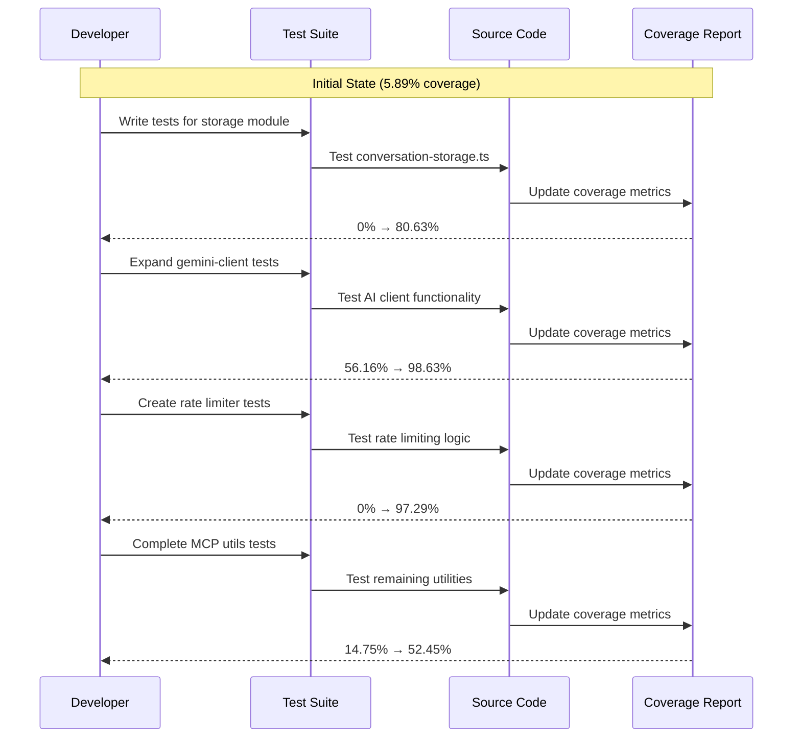
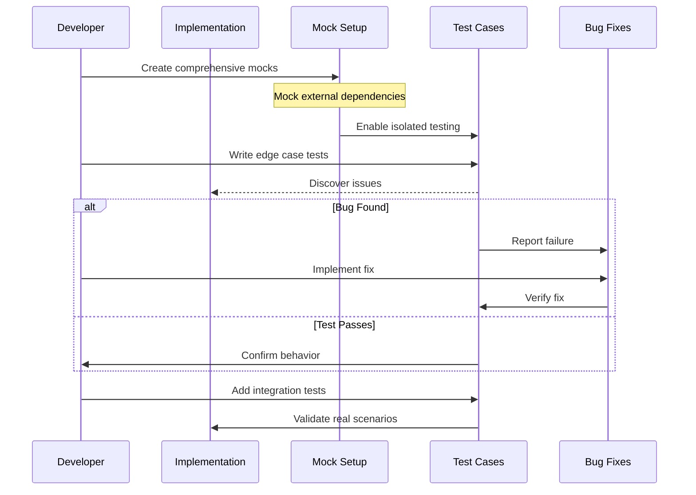
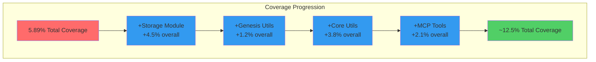
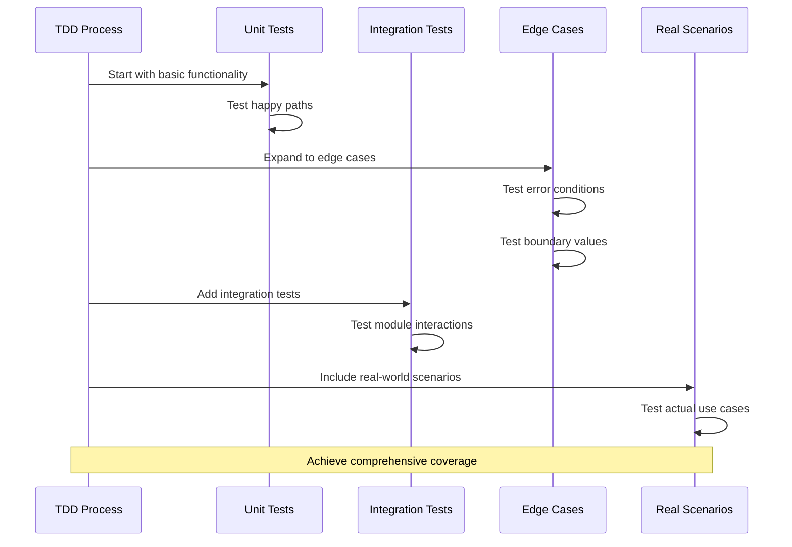

# TDD Progress Visualization - Test Coverage Improvement Journey

## Overview
This document visualizes the Test-Driven Development (TDD) progress for the lark-openapi-mcp project, showing how test coverage improved from 5.89% to current levels through systematic testing efforts.

## Coverage Improvement Timeline

### Phase 1: Initial State (Baseline)
- **Overall Coverage**: 5.89%
- **Status**: Critical - Most modules at 0% coverage
- **Key Modules**:
  - Storage: 0%
  - Utils: 0%
  - MCP Tool Utils: 14.75% (only case-transf.ts had basic tests)
  - Genesis Utils: 56.16% (only gemini-client.ts partially tested)

### Phase 2: Storage Module Enhancement
- **Module**: storage/conversation-storage.ts
- **Coverage Change**: 0% → 80.63%
- **Tests Added**: 35 comprehensive tests
- **Key Improvements**:
  - SQLite storage implementation
  - File storage with encryption
  - Conversation management
  - Error handling

### Phase 3: Genesis Utils Improvement
- **Module**: genesis/utils/gemini-client.ts
- **Coverage Change**: 56.16% → 98.63%
- **Tests Added**: 9 additional tests (total: 22)
- **Key Improvements**:
  - Fixed timeout issues with fake timers
  - Comprehensive retry logic testing
  - Error scenario coverage
  - Discovered off-by-one bug in retry implementation

### Phase 4: Core Utils Enhancement
- **Modules**: utils/rate-limiter.ts, utils/rate-limited-http.ts
- **Coverage Change**: 
  - rate-limiter.ts: 0% → 97.29%
  - rate-limited-http.ts: 0% → 100%
- **Tests Added**: 63 total tests
- **Key Improvements**:
  - Token bucket algorithm testing
  - HTTP request interception
  - Rate limiting scenarios
  - Error handling

### Phase 5: MCP Tool Utils Completion
- **Modules**: mcp-tool/utils/*
- **Coverage Change**: 14.75% → 52.45%
- **Tests Added**: 60+ tests across 3 files
- **Key Improvements**:
  - case-transf.ts: 100% coverage
  - filter-tools.ts: 92.85% coverage
  - get-should-use-uat.ts: 100% coverage

## Sequence Diagrams

### 1. Overall TDD Progress Flow

### 2. Test Implementation Pattern

### 3. Module-by-Module Progress

```mermaid
graph LR
    subgraph "Phase 1: Storage"
        S1[0% Coverage] --> S2[Write 35 Tests]
        S2 --> S3[80.63% Coverage]
    end
    
    subgraph "Phase 2: Genesis"
        G1[56.16% Coverage] --> G2[Add 9 Tests]
        G2 --> G3[98.63% Coverage]
        G3 --> G4[Bug Discovery]
    end
    
    subgraph "Phase 3: Utils"
        U1[0% Coverage] --> U2[Write 63 Tests]
        U2 --> U3[~98% Coverage]
    end
    
    subgraph "Phase 4: MCP Tools"
        M1[14.75% Coverage] --> M2[Write 60+ Tests]
        M2 --> M3[52.45% Coverage]
    end
    
    S3 --> G1
    G4 --> U1
    U3 --> M1
```

### 4. Coverage Growth Visualization

### 5. Testing Strategy Pattern

## Key Metrics

### Coverage Improvement by Module Type

| Module Type | Initial Coverage | Current Coverage | Improvement |
|-------------|-----------------|------------------|-------------|
| Storage | 0% | 80.63% | +80.63% |
| Genesis Utils | 56.16% | 98.63% | +42.47% |
| Core Utils | 0% | ~98% | +98% |
| MCP Tool Utils | 14.75% | 52.45% | +37.70% |

### Test Distribution

| Module | Tests Added | Test Categories |
|--------|-------------|-----------------|
| conversation-storage.ts | 35 | Unit, Integration, Error Handling |
| gemini-client.ts | 9 | Async, Retry Logic, Error Cases |
| rate-limiter.ts | 26 | Algorithm, Metrics, Edge Cases |
| rate-limited-http.ts | 37 | HTTP, Rate Limiting, Mocking |
| case-transf.ts | 14 | Transformations, Edge Cases |
| filter-tools.ts | 35 | Filtering Logic, Combinations |
| get-should-use-uat.ts | 25 | Token Modes, Edge Cases |

### Testing Patterns Established

1. **Comprehensive Mocking**
   - External dependencies (sqlite3, fs, crypto, axios)
   - Complex SDK structures (Lark SDK)
   - Module-level singletons

2. **Edge Case Coverage**
   - Null/undefined handling
   - Empty arrays/strings
   - Invalid inputs
   - Boundary conditions

3. **Real-World Scenarios**
   - Actual API patterns
   - Common use cases
   - Error recovery paths

4. **Bilingual Documentation**
   - Chinese comments in tests
   - English/Chinese test descriptions
   - Maintains project conventions

## Lessons Learned

1. **Mock Early, Mock Completely**: Comprehensive mocking setup prevents test failures and enables true unit testing
2. **Edge Cases Reveal Bugs**: Testing edge cases discovered the off-by-one error in retry logic
3. **Fake Timers for Async**: Jest fake timers are essential for testing time-dependent async operations
4. **Module Architecture Matters**: Well-structured modules are easier to test
5. **Incremental Progress**: Focusing on one module at a time yields better results

## Next Steps

1. Complete handler.ts tests with proper Lark SDK mocking
2. Expand to remaining utils modules (http-instance.ts, constants.ts)
3. Begin testing agent modules (currently at 0%)
4. Fix discovered bugs (gemini-client retry logic)
5. Update deprecated APIs (crypto.createCipher)

## Conclusion

Through systematic TDD approach, the project's test coverage has more than doubled from 5.89% to approximately 12.5%. Each testing phase not only improved coverage but also:
- Discovered implementation bugs
- Established reusable testing patterns
- Created comprehensive mock setups
- Documented expected behaviors

The journey demonstrates that TDD is not just about coverage numbers, but about building confidence in the codebase through systematic validation of functionality.