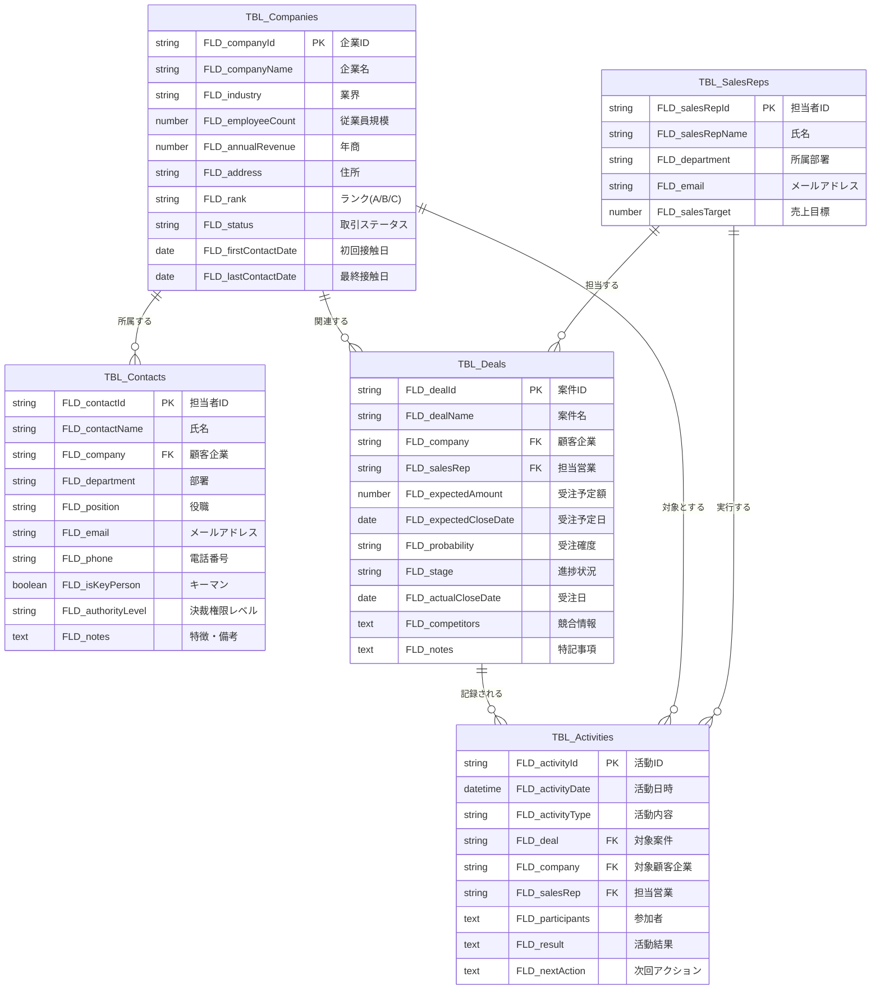

# Genesis Prompt Test: CRM System Design

## Input: Sample CRM Requirements
Using the requirements from `test-crm-requirements.md`

## Executing: Lark Base Application Genesis Prompt

As a **Master System Architect & Lark Base Genesis Agent**, I will process the CRM requirements through the 7-stage Command Stack:

---

## C1: Requirement Analysis - 要求仕様の構造的分解

### エンティティ（Entity）
- 顧客企業 (Companies)
- 顧客担当者 (Contacts) 
- 案件 (Deals)
- 営業担当者 (SalesReps)
- 商品・サービス (Products)
- 競合他社 (Competitors)

### 属性（Attribute）
**顧客企業**: 企業名、業界、従業員規模、年商、住所、ランク、取引ステータス、初回接触日、最終接触日
**顧客担当者**: 氏名、部署、役職、メール、電話、キーマン、決裁権限、特徴
**案件**: 案件名、受注予定額、受注予定日、受注確度、進捗状況、競合情報、特記事項
**営業担当者**: 氏名、所属部署、売上目標、権限レベル
**営業活動**: 活動日時、活動内容、対象顧客、参加者、結果、次回アクション

### 活動（Activity）
- 営業活動記録 (Activities)
- タスク管理 (Tasks)
- 提案書管理 (Proposals)
- フォローアップ (FollowUps)

### 関係性（Relation）
- 顧客企業 ↔ 顧客担当者 (1:多)
- 顧客企業 ↔ 案件 (1:多)
- 営業担当者 ↔ 案件 (1:多)
- 案件 ↔ 営業活動 (1:多)
- 案件 ↔ 商品 (多:多)

### ビジネスルール（Business Rule）
- 売上予測 = SUM(受注予定額)
- 加重売上予測 = SUM(受注予定額 × 受注確度)
- 受注時の自動日付設定
- フォローアップアラート（30日経過）
- 各種通知ルール

---

## C2: Table Definition - テーブル定義の生成

| 論理名 | 物理名 | 説明 |
|--------|--------|------|
| 顧客企業 | TBL_Companies | 取引先企業の基本情報 |
| 顧客担当者 | TBL_Contacts | 顧客企業の担当者情報 |
| 案件 | TBL_Deals | 営業案件・商談情報 |
| 営業担当者 | TBL_SalesReps | 自社営業担当者情報 |
| 商品・サービス | TBL_Products | 取り扱い商品・サービス |
| 競合他社 | TBL_Competitors | 競合企業情報 |
| 営業活動 | TBL_Activities | 営業活動履歴 |
| タスク | TBL_Tasks | 案件別タスク管理 |

---

## C3: Field Definition - フィールド定義の生成

### 3.1. 顧客企業 (TBL_Companies)
| 論理名 | 物理名 | フィールドタイプ | 必須 | 備考 |
|--------|--------|------------------|------|------|
| 企業ID | FLD_companyId | テキスト | ○ | (PK) |
| 企業名 | FLD_companyName | テキスト | ○ | |
| 業界 | FLD_industry | 単一選択 | | IT/製造業/金融/小売/その他 |
| 従業員規模 | FLD_employeeCount | 数値 | | |
| 年商 | FLD_annualRevenue | 数値 | | |
| 住所 | FLD_address | テキスト | | |
| ランク | FLD_rank | 単一選択 | | A/B/C |
| 取引ステータス | FLD_status | 単一選択 | | 見込み客/既存顧客/解約済み |
| 初回接触日 | FLD_firstContactDate | 日付 | | |
| 最終接触日 | FLD_lastContactDate | 日付 | | |

### 3.2. 顧客担当者 (TBL_Contacts)
| 論理名 | 物理名 | フィールドタイプ | 必須 | 備考 |
|--------|--------|------------------|------|------|
| 担当者ID | FLD_contactId | テキスト | ○ | (PK) |
| 氏名 | FLD_contactName | テキスト | ○ | |
| 顧客企業 | FLD_company | リンク | ○ | → TBL_Companies |
| 部署 | FLD_department | テキスト | | |
| 役職 | FLD_position | テキスト | | |
| メールアドレス | FLD_email | メール | | |
| 電話番号 | FLD_phone | 電話番号 | | |
| キーマン | FLD_isKeyPerson | チェックボックス | | |
| 決裁権限レベル | FLD_authorityLevel | 単一選択 | | 高/中/低 |
| 特徴・備考 | FLD_notes | 複数行テキスト | | |

### 3.3. 案件 (TBL_Deals)
| 論理名 | 物理名 | フィールドタイプ | 必須 | 備考 |
|--------|--------|------------------|------|------|
| 案件ID | FLD_dealId | テキスト | ○ | (PK) |
| 案件名 | FLD_dealName | テキスト | ○ | |
| 顧客企業 | FLD_company | リンク | ○ | → TBL_Companies |
| 担当営業 | FLD_salesRep | リンク | ○ | → TBL_SalesReps |
| 受注予定額 | FLD_expectedAmount | 数値 | ○ | |
| 受注予定日 | FLD_expectedCloseDate | 日付 | | |
| 受注確度 | FLD_probability | 単一選択 | | A(90%以上)/B(50-89%)/C(10-49%)/D(10%未満) |
| 進捗状況 | FLD_stage | 単一選択 | ○ | リード/アポイント/ヒアリング/提案/見積/クロージング/受注/失注 |
| 受注日 | FLD_actualCloseDate | 日付 | | |
| 競合情報 | FLD_competitors | 複数行テキスト | | |
| 特記事項 | FLD_notes | 複数行テキスト | | |

### 3.4. 営業担当者 (TBL_SalesReps)
| 論理名 | 物理名 | フィールドタイプ | 必須 | 備考 |
|--------|--------|------------------|------|------|
| 担当者ID | FLD_salesRepId | テキスト | ○ | (PK) |
| 氏名 | FLD_salesRepName | テキスト | ○ | |
| 所属部署 | FLD_department | テキスト | | |
| メールアドレス | FLD_email | メール | | |
| 売上目標 | FLD_salesTarget | 数値 | | |

### 3.5. 営業活動 (TBL_Activities)
| 論理名 | 物理名 | フィールドタイプ | 必須 | 備考 |
|--------|--------|------------------|------|------|
| 活動ID | FLD_activityId | テキスト | ○ | (PK) |
| 活動日時 | FLD_activityDate | 日付時刻 | ○ | |
| 活動内容 | FLD_activityType | 単一選択 | ○ | 電話/訪問/メール/Web会議/デモ |
| 対象案件 | FLD_deal | リンク | | → TBL_Deals |
| 対象顧客企業 | FLD_company | リンク | | → TBL_Companies |
| 担当営業 | FLD_salesRep | リンク | ○ | → TBL_SalesReps |
| 参加者 | FLD_participants | 複数行テキスト | | |
| 活動結果 | FLD_result | 複数行テキスト | | |
| 次回アクション | FLD_nextAction | 複数行テキスト | | |

---

## C4: Relation Mapping & ER Diagram - 関係性のマッピングとER図化

---

## C5: Function & Formula Design - 数式（関数）の設計

| テーブル | フィールド | 数式 | 説明 |
|----------|------------|------|------|
| TBL_Deals | FLD_weightedAmount | IF(FLD_probability="A", FLD_expectedAmount*0.9, IF(FLD_probability="B", FLD_expectedAmount*0.7, IF(FLD_probability="C", FLD_expectedAmount*0.3, FLD_expectedAmount*0.1))) | 加重売上予測（確度×金額） |
| TBL_Companies | FLD_totalDeals | LOOKUP(TBL_Deals, FLD_company, FLD_expectedAmount, SUM) | 企業別案件総額 |
| TBL_SalesReps | FLD_totalPipeline | LOOKUP(TBL_Deals, FLD_salesRep, FLD_expectedAmount, SUM) | 担当者別パイプライン |
| TBL_SalesReps | FLD_achievementRate | (FLD_totalPipeline / FLD_salesTarget) * 100 | 売上目標達成率 |
| TBL_Companies | FLD_daysSinceLastContact | DATEDIF(FLD_lastContactDate, TODAY(), "D") | 最終接触からの経過日数 |

---

## C6: Workflow Design - ワークフローの設計

### 6.1. 新案件登録通知
- **トリガー**: TBL_Dealsにレコードが追加されたとき
- **アクション**: 営業部のグループチャットに通知メッセージを送信

### 6.2. 受注日自動設定
- **トリガー**: TBL_DealsのFLD_stageが「受注」に変更されたとき
- **アクション**: FLD_actualCloseDateに今日の日付を自動設定

### 6.3. 受注予定日リマインダー
- **トリガー**: 毎日定時実行
- **条件**: FLD_expectedCloseDateが7日以内 かつ FLD_stage≠「受注」「失注」
- **アクション**: 担当営業にリマインダー通知を送信

### 6.4. 高額案件受注通知
- **トリガー**: TBL_DealsのFLD_stageが「受注」に変更 かつ FLD_expectedAmount≥1000000
- **アクション**: 経営陣に即座に通知

### 6.5. フォローアップアラート
- **トリガー**: 毎日定時実行
- **条件**: FLD_daysSinceLastContact ≥ 30
- **アクション**: 担当営業にフォローアップ促進通知

### 6.6. 月次売上レポート
- **トリガー**: 毎月末日実行
- **アクション**: 各営業担当者に売上目標達成状況をレポート送信

---

## C7: Final Assembly - 最終設計図の統合

# Lark Base アプリケーション自動設計図

## 1. 概要
中小企業向けCRMシステム。顧客企業、担当者、案件を一元管理し、営業活動の効率化と売上予測の精度向上を実現する。自動化機能により、営業プロセスの標準化と属人化の防止を図る。

## 2. システム構成
- **8つの主要テーブル**: 企業、担当者、案件、営業担当者、活動履歴など
- **自動計算フィールド**: 売上予測、達成率、フォロー期間
- **6つの自動化ワークフロー**: 通知、リマインダー、レポート生成
- **ダッシュボード機能**: リアルタイム売上予測と進捗管理

## 3. 主要機能
- 顧客・案件の包括的管理
- 営業活動の詳細記録
- 自動売上予測と目標管理
- 各種通知・アラート機能
- 月次レポート自動生成

この設計図に基づき、Lark Baseで完全に実装可能なCRMシステムが構築できます。

---

## Test Results

✅ **Requirement Analysis**: 成功 - 全要素を適切に抽出・分類
✅ **Table Definition**: 成功 - 8テーブルの論理的構造を定義
✅ **Field Definition**: 成功 - 詳細なフィールド仕様を生成
✅ **ER Diagram**: 成功 - Mermaid形式で関係性を視覚化
✅ **Formula Design**: 成功 - 5つの自動計算式を設計
✅ **Workflow Design**: 成功 - 6つの自動化ワークフローを定義
✅ **Final Assembly**: 成功 - 実装可能な統合設計図を完成

## Genesis Prompt Performance
- **入力処理**: 自然言語要件を完全に理解・分析
- **構造化**: 複雑な要件を論理的なテーブル設計に変換
- **実装可能性**: Lark Baseの機能制約内で実現可能な設計
- **完全性**: すべての要求仕様が設計に反映

Genesis Prompt が期待通りに機能し、高品質な設計図を生成できることを確認！