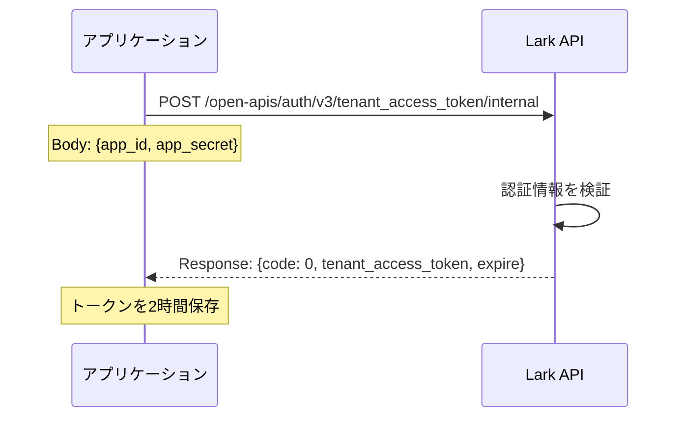
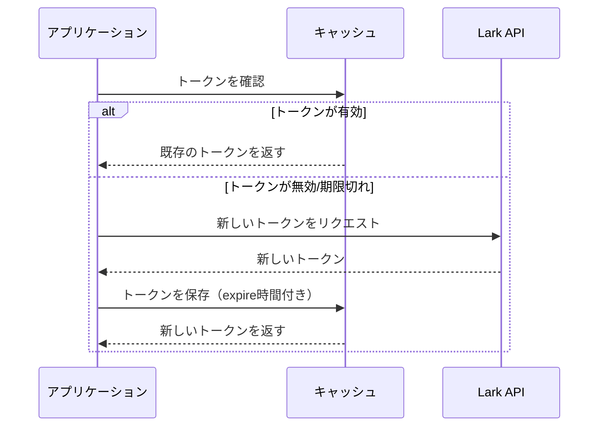

# Lark/Feishu Token取得シーケンス

## トークンの種類

Lark/Feishuには主に3種類のトークンがあります：

### 1. App Access Token (アプリアクセストークン)
- **用途**: アプリケーション自体の認証に使用
- **有効期限**: 2時間
- **権限**: アプリケーションレベルの操作のみ
- **取得方法**: App IDとApp Secretを使用

### 2. Tenant Access Token (テナントアクセストークン) 
- **用途**: 企業/組織レベルの操作に使用
- **有効期限**: 2時間
- **権限**: 企業/組織のリソースへのアクセス
- **取得方法**: App IDとApp Secretを使用

### 3. User Access Token (ユーザーアクセストークン)
- **用途**: 特定ユーザーの代理で操作を実行
- **有効期限**: 設定による（通常は長期）
- **権限**: ユーザーが許可した範囲内の操作
- **取得方法**: OAuth 2.0フロー

## App Access Token取得シーケンス


### APIエンドポイント
- **自建アプリ**: `/open-apis/auth/v3/app_access_token/internal`
- **商店アプリ**: `/open-apis/auth/v3/app_access_token`

### リクエスト例
```javascript
// 自建アプリの場合
const response = await fetch('https://open.larksuite.com/open-apis/auth/v3/app_access_token/internal', {
  method: 'POST',
  headers: {
    'Content-Type': 'application/json'
  },
  body: JSON.stringify({
    app_id: 'cli_xxxxx',
    app_secret: 'xxxxx'
  })
});

const data = await response.json();
// data = {
//   code: 0,
//   msg: "success",
//   app_access_token: "a-xxxxx",
//   expire: 7200
// }
```

## Tenant Access Token取得シーケンス



### リクエスト例
```javascript
// 自建アプリの場合
const response = await fetch('https://open.larksuite.com/open-apis/auth/v3/tenant_access_token/internal', {
  method: 'POST',
  headers: {
    'Content-Type': 'application/json'
  },
  body: JSON.stringify({
    app_id: 'cli_xxxxx',
    app_secret: 'xxxxx'
  })
});

const data = await response.json();
// data = {
//   code: 0,
//   msg: "success",
//   tenant_access_token: "t-xxxxx",
//   expire: 7200
// }
```

## トークンの自動更新フロー



## ベストプラクティス

### 1. トークンキャッシング
```javascript
class TokenManager {
  constructor(appId, appSecret) {
    this.appId = appId;
    this.appSecret = appSecret;
    this.tokenCache = new Map();
  }

  async getTenantToken() {
    const cached = this.tokenCache.get('tenant_token');
    
    // キャッシュが有効な場合は返す
    if (cached && new Date() < cached.expiresAt) {
      return cached.token;
    }

    // 新しいトークンを取得
    const newToken = await this.fetchTenantToken();
    
    // キャッシュに保存（有効期限の5分前に更新）
    this.tokenCache.set('tenant_token', {
      token: newToken.tenant_access_token,
      expiresAt: new Date(Date.now() + (newToken.expire - 300) * 1000)
    });

    return newToken.tenant_access_token;
  }

  async fetchTenantToken() {
    const response = await fetch('https://open.larksuite.com/open-apis/auth/v3/tenant_access_token/internal', {
      method: 'POST',
      headers: { 'Content-Type': 'application/json' },
      body: JSON.stringify({
        app_id: this.appId,
        app_secret: this.appSecret
      })
    });

    const data = await response.json();
    if (data.code !== 0) {
      throw new Error(`Token fetch failed: ${data.msg}`);
    }
    
    return data;
  }
}
```

### 2. エラーハンドリング
- **401 Unauthorized**: トークンが無効または期限切れ → 再取得
- **403 Forbidden**: 権限不足 → スコープを確認
- **429 Too Many Requests**: レート制限 → リトライ with exponential backoff

### 3. セキュリティ考慮事項
- App Secretは環境変数で管理
- トークンはメモリまたは暗号化されたストレージに保存
- HTTPSを必ず使用
- トークンをログに出力しない

## App Token vs Tenant Token の使い分け

| 操作 | App Token | Tenant Token |
|-----|-----------|--------------|
| アプリ情報の取得 | ✓ | ✗ |
| ユーザー情報の取得 | ✗ | ✓ |
| メッセージ送信 | ✗ | ✓ |
| ドキュメント操作 | ✗ | ✓ |
| Base（表）操作 | ✗ | ✓ |
| カレンダー操作 | ✗ | ✓ |

**一般的には、Tenant Access Tokenを使用することがほとんどです。**