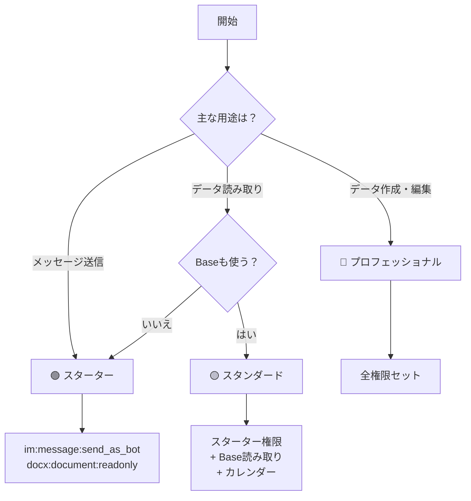

# 🔐 Lark MCP 権限マトリックス

## 権限早見表

### 🎯 目的別クイック選択

| やりたいこと | 必要な権限セット |
|------------|----------------|
| 💬 Botでメッセージ送信 | 🟢 スターター |
| 📄 ドキュメント読み取り | 🟢 スターター |
| 📊 Base読み取りのみ | 🟡 スタンダード |
| 🔧 Base作成・編集 | 🔴 プロフェッショナル |
| 📅 カレンダー管理 | 🟡 スタンダード |
| 🚀 フル自動化 | 🔴 プロフェッショナル |

## 📊 詳細権限マトリックス

### メッセージング系

| 権限 | 読取 | 送信 | 管理 | 説明 |
|------|:----:|:----:|:----:|------|
| `im:message` | ✅ | ❌ | ❌ | メッセージ読み取り |
| `im:message:send_as_bot` | ❌ | ✅ | ❌ | Bot送信 |
| `im:chat` | ✅ | ❌ | ✅ | チャット管理 |
| `im:chat:readonly` | ✅ | ❌ | ❌ | チャット情報のみ |
| `im:resource` | ✅ | ✅ | ❌ | ファイル・画像 |

### Base（データベース）系

| 権限 | 読取 | 作成 | 編集 | 削除 | 説明 |
|------|:----:|:----:|:----:|:----:|------|
| `bitable:app:readonly` | ✅ | ❌ | ❌ | ❌ | Base読み取り |
| `bitable:app` | ✅ | ✅ | ✅ | ✅ | Base完全管理 |
| `bitable:table:readonly` | ✅ | ❌ | ❌ | ❌ | テーブル読み取り |
| `bitable:table` | ✅ | ✅ | ✅ | ✅ | テーブル完全管理 |
| `bitable:record:readonly` | ✅ | ❌ | ❌ | ❌ | レコード読み取り |
| `bitable:record` | ✅ | ✅ | ✅ | ✅ | レコード完全管理 |
| `bitable:field:readonly` | ✅ | ❌ | ❌ | ❌ | フィールド情報 |

### ドキュメント系

| 権限 | 読取 | 作成 | 編集 | 削除 | 説明 |
|------|:----:|:----:|:----:|:----:|------|
| `docx:document:readonly` | ✅ | ❌ | ❌ | ❌ | ドキュメント読み取り |
| `docx:document` | ✅ | ✅ | ✅ | ✅ | ドキュメント完全管理 |
| `docs:doc:readonly` | ✅ | ❌ | ❌ | ❌ | Docs読み取り |
| `docs:doc` | ✅ | ✅ | ✅ | ✅ | Docs完全管理 |
| `wiki:wiki:readonly` | ✅ | ❌ | ❌ | ❌ | Wiki読み取り |
| `wiki:wiki` | ✅ | ✅ | ✅ | ✅ | Wiki完全管理 |

### カレンダー系

| 権限 | 読取 | 作成 | 編集 | 削除 | 説明 |
|------|:----:|:----:|:----:|:----:|------|
| `calendar:calendar:readonly` | ✅ | ❌ | ❌ | ❌ | カレンダー読み取り |
| `calendar:calendar` | ✅ | ✅ | ✅ | ✅ | カレンダー完全管理 |
| `calendar:event` | ✅ | ✅ | ✅ | ✅ | イベント管理 |

### ユーザー情報系

| 権限 | 基本情報 | メール | 部署 | 従業員ID |
|------|:--------:|:------:|:----:|:--------:|
| `contact:user.base:readonly` | ✅ | ❌ | ❌ | ❌ |
| `contact:user.email:readonly` | ❌ | ✅ | ❌ | ❌ |
| `contact:department.base:readonly` | ❌ | ❌ | ✅ | ❌ |
| `contact:user.employee_id:readonly` | ❌ | ❌ | ❌ | ✅ |
| `contact:contact:readonly` | ✅ | ✅ | ✅ | ❌ |

## 🚀 推奨権限組み合わせ

### 1. メッセージBot専用
```yaml
最小構成:
  - im:message:send_as_bot

推奨構成:
  - im:message:send_as_bot
  - im:message
  - im:chat:readonly
```

### 2. ドキュメント処理専用
```yaml
読み取り専用:
  - docx:document:readonly
  - docs:doc:readonly

フル機能:
  - docx:document
  - docs:doc
  - drive:drive
```

### 3. データ分析専用
```yaml
基本構成:
  - bitable:app:readonly
  - bitable:table:readonly
  - bitable:record:readonly
  - sheets:spreadsheet:readonly

分析＋レポート作成:
  - 上記すべて
  - docx:document
  - im:message:send_as_bot
```

### 4. プロジェクト管理
```yaml
必須:
  - task:task
  - calendar:calendar
  - calendar:event
  - im:message
  - im:message:send_as_bot

推奨追加:
  - bitable:app
  - docx:document
  - contact:user.base:readonly
```

### 5. CRM完全自動化
```yaml
フルセット:
  - bitable:app
  - bitable:table
  - bitable:record
  - contact:contact:readonly
  - contact:user.base:readonly
  - im:message
  - im:message:send_as_bot
  - docx:document
  - calendar:event
  - task:task
```

## 🔍 権限選択フローチャート



## 💡 権限追加のベストプラクティス

### ✅ DO
- 最小権限から始める
- 読み取り専用を優先
- 段階的に権限追加
- チームと相談
- テスト環境で検証

### ❌ DON'T
- 不要な権限を追加
- 一度に全権限を要求
- テストなしで本番適用
- 権限の意味を理解せず追加
- セキュリティを軽視

## 📝 権限申請テンプレート

```
【権限追加申請】

追加したい権限:
- bitable:app
- bitable:table
- bitable:record

理由:
顧客管理Baseの自動作成・更新機能の実装のため

影響範囲:
- 新規Base作成
- 既存Baseの更新
- レコードの追加・編集

セキュリティ対策:
- アクセスログの記録
- 操作履歴の保存
- 定期的な権限見直し
```

---

📌 **重要**: 権限は組織のセキュリティポリシーに従って適切に管理してください。