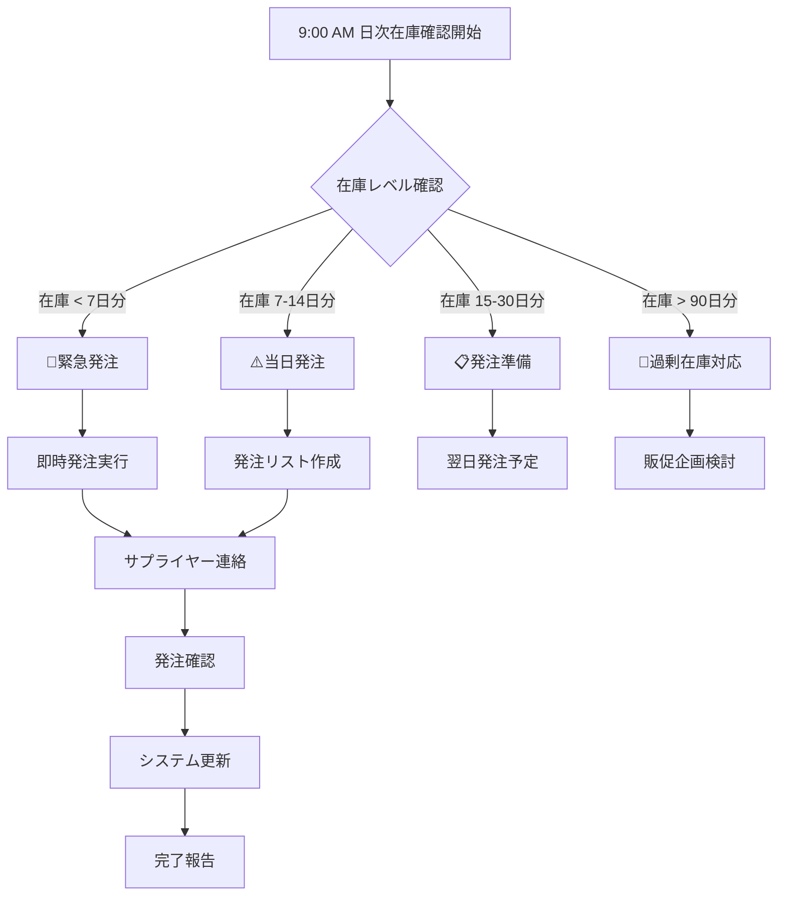
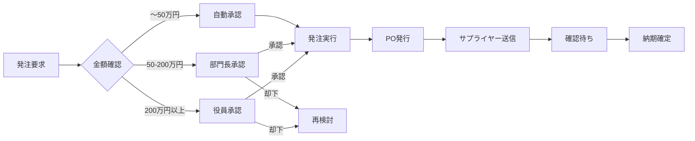
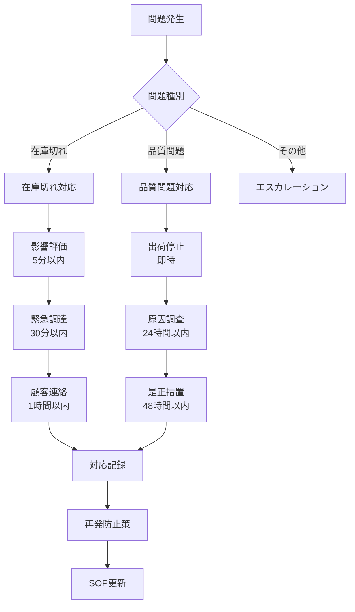

# EC運営ワークフロー図
## EC Operation Workflow Diagrams

---

## 📊 在庫管理フロー


---

## 🛒 発注承認フロー


---

## 🔄 在庫補充サイクル
```
┌─────────────────────────────────────────────────────┐
│                  在庫管理サイクル                      │
├─────────────────────────────────────────────────────┤
│                                                     │
│  ①監視     ②判定      ③発注      ④入荷          │
│  ┌───┐    ┌───┐     ┌───┐     ┌───┐         │
│  │日次│ => │発注│ => │承認│ => │検品│         │
│  │確認│    │判定│     │実行│     │入庫│         │
│  └───┘    └───┘     └───┘     └───┘         │
│    ↑                                  ↓           │
│    └──────────────────────────────────┘           │
│                                                     │
│  KPI測定ポイント:                                    │
│  ・在庫回転率（月次）                                 │
│  ・欠品率（日次）                                    │
│  ・発注精度（週次）                                   │
└─────────────────────────────────────────────────────┘
```

---

## 🚨 緊急対応フロー


---

## 📈 パフォーマンス測定
```
週次レビュー（毎週月曜 10:00）
├── 在庫分析
│   ├── ABC分析更新
│   ├── 在庫回転率計算
│   └── 滞留在庫確認
│
├── 発注分析
│   ├── リードタイム分析
│   ├── コスト分析
│   └── サプライヤー評価
│
└── 改善活動
    ├── 問題点抽出
    ├── 対策立案
    └── 実施計画
```

---

## ✅ 役割と責任（RACI）
```
タスク              実行(R) 説明責任(A) 相談(C) 情報共有(I)
━━━━━━━━━━━━━━━━━━━━━━━━━━━━━━━━━━━━━
日次在庫確認          担当者    責任者      -       部門長
発注実行             担当者    責任者     財務部    部門長
品質検品             QC担当    QC責任者   仕入部     全員
緊急対応             当番者    部門長     役員      全員
週次KPI作成          責任者    部門長      -       役員
月次棚卸             全員      責任者      -       財務部
```

---

## 🎯 目標達成のための重要成功要因（CSF）

1. **リアルタイム可視化**
   - 在庫状況の即時把握
   - アラート機能の活用
   - ダッシュボード監視

2. **迅速な意思決定**
   - 明確な承認権限
   - 判断基準の標準化
   - エスカレーション手順

3. **継続的改善**
   - 週次レビューの徹底
   - KPI目標の更新
   - ベストプラクティス共有

4. **チームワーク**
   - 役割の明確化
   - コミュニケーション強化
   - 知識の共有